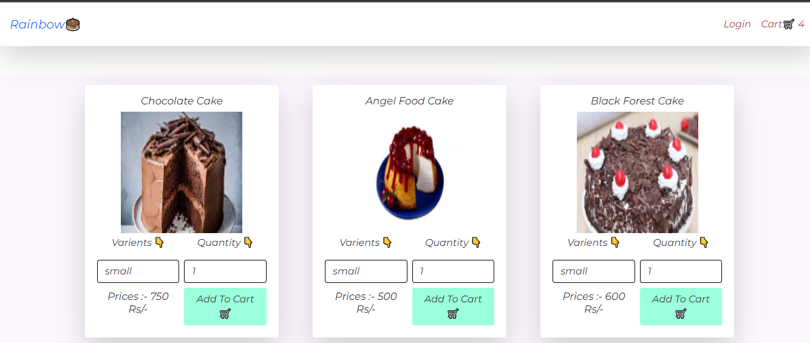
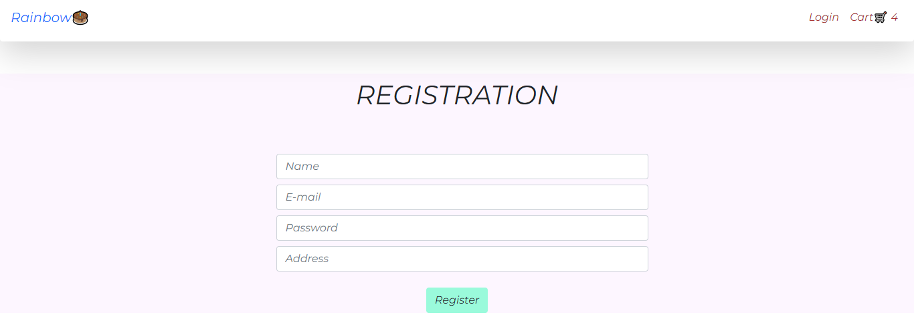
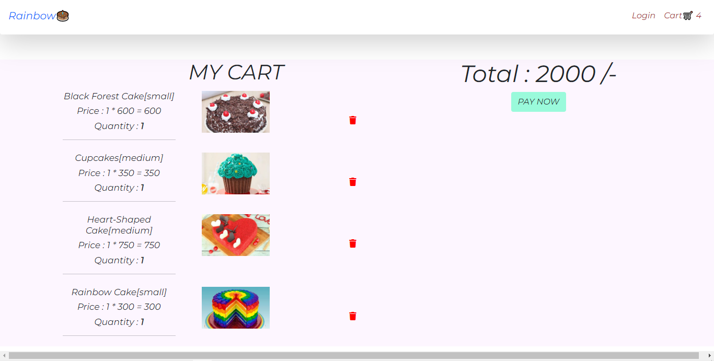

# Rainbow-Cakes

<h2 style="color:red;">Web App Screenshots :</h2>

<h3 align="center" dir="auto">HOME SCREEN</h3>

<h3 align="center" dir="auto" >LOGIN SCREEN</h3>

<h3 align="center" dir="auto" >REGISTER SCREEN</h3>

<h3 align="center" dir="auto" >CART SCREEN</h3>

Using Technology :
      FrontEnd :- React, HTML, CSS, Redux, JavaScript
      BackEnd  :- NODE, Express
      DATABASE :- MONGODB
      

I am currently working on it now,It has the functionality of 
1. User Registration
2. Login
3. Add to cart
4. Delete Items From Cart

Future Scope :
1.Order details realted to user
2.payment getway 
3.Admin pannel

         
